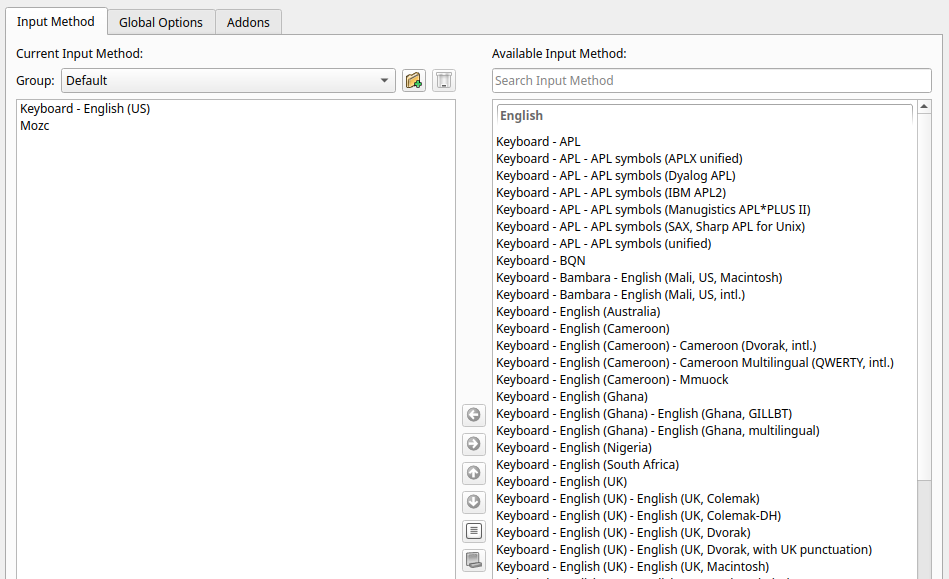
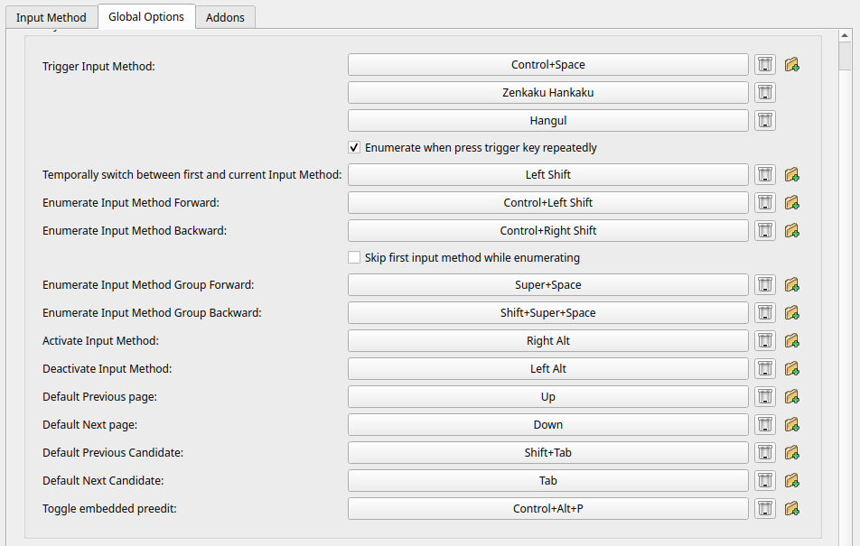

# Arch Linux Install Scripts

Scripts for Arch Linux installation

## Requirement

- UEFI
- New PC as possible (if old, you may need to install additional drivers)
- Standard devices (similarly, you may need additional drivers)
- Standard US keyboard

## Scripts

### `base.sh`

- Partition the disk
- Format the partitions
- Install essential packages
- Localization
- Network configuration (NetworkManager)
- Boot loader (GRUB)
- Add a sudo user (wheel group)
- Utilizing multiple cores for Pacman and makepkg
- AUR helper (Yay)
- Clock synchronization (systemd-timesyncd)
- Swap file (zram)

| Mount point | Partition              | Partition type GUID                                         | Size                    | File system |
| ----------- | ---------------------- | ----------------------------------------------------------- | ----------------------- | ----------- |
| /mnt/boot   | first (e.g. /dev/sda1) | C12A7328-F81F-11D2-BA4B-00A0C93EC93B: EFI system partition  | 300 MiB                 | FAT32       |
| /mnt        | second                 | 4F68BCE3-E8CD-4DB1-96E7-FBCAF984B709: Linux x86-64 root (/) | Remainder of the device | Ext4        |

#### Available environment variables

- ALIS_INSTALL_DEVICE_PATH
  - e.g. `/dev/sda`
- ALIS_HOSTNAME
- ALIS_CPU_MANUFACTURER
  - `intel` or `amd`
- ALIS_ROOT_PASSWD
- ALIS_USER_NAME
- ALIS_USER_PASSWD

### `gui-i3.sh`

- Display server (Xorg)
- Official configuration utility to the RandR (xrandr, arandr)
- Display manager (LightDM)
- Programming font (Cica)
- Window manager (i3)
  - Status bar (i3status)
  - Application launchers (Rofi)
- Terminal emulators (Alacritty)
- Sound management (ALSA)
- 日本語入力 (Fcitx5, Mozc)
  - 左 Alt で英字入力、右 Alt で日本語入力
- Web browser (Chromium)
- Command-line shell (fish)
  - Fisher
- Graphical image viewers (Feh)
- File managers (SpaceFM)
- Screenshot (xfce4-screenshooter)
- Editor (Code)

#### Available environment variables

- ALIS_USER_PASSWD
- ALIS_VIDEO_DRIVER
  - See [Xorg#Driver_installation - ArchWiki](https://wiki.archlinux.org/index.php/Xorg#Driver_installation)
- ALIS_I3_MODIFIER_KEY
  - `win` or `alt`
- ALIS_FONT_SIZE

### `gui-xfce.sh`

> NOT UPDATED

- Display server (Xorg)
- Display manager (LightDM)
- Desktop environment (Xfce)
- Tools for sound management (ALSA, PulseAudio)
- 日本語入力 (Fcitx, Mozc)
  - 左 Alt で英字入力、右 Alt で日本語入力
  - システムロケールは英語
- Web browser (FireFox)

#### Available environment variables

- ALIS_USER_PASSWD
- ALIS_VIDEO_DRIVER
  - See [Xorg#Driver_installation - ArchWiki](https://wiki.archlinux.org/index.php/Xorg#Driver_installation)

## Usage

### Install Base System

`base.sh`

This script should be run in a live environment.
If you are using a wireless connection, you need to be connected to the Internet using `wifi-menu` or other tools before running.

```sh
$ curl -sLO https://git.io/alis-base
$ chmod +x alis-base
$ ./alis-base

$ reboot
```

After rebooting, enable network time sync.

```sh
$ timedatectl set-ntp true
```

### GUI

`gui-*.sh` (`gui-xfce.sh`, `gui-i3.sh`)

After running `base.sh` and rebooting, you can run this script in the installed system.
Log in a user other than root, connect to the Internet using NetworkManager (`nmtui` is easy), and run this script.

Run the following commands and you can find out which video driver you want to use in advance.

[Xorg#Driver_installation - ArchWiki](https://wiki.archlinux.org/index.php/Xorg#Driver_installation)

```sh
lspci | grep -e VGA -e 3D
```

```sh
$ curl -sLO https://git.io/alis-gui-*
$ chmod +x alis-gui-*
$ ./alis-gui-*

$ rm alis-gui-*
$ sudo reboot
```

再起動後、Fcitx5の設定を行ってください。

まず、`fcitx5-configtool`を起動します。

「Input Method」のタブを開き、インプットメソッドとしてmozcを追加します。 



次に、「Global Options」のタブを開き、「Activate Input Method」に
右Alt（もしくは日本語入力に切り替えたいキー）を、
「Deactivate Input Method」に左Alt（もしくは英語入力に切り替えたいキー）を設定します。



